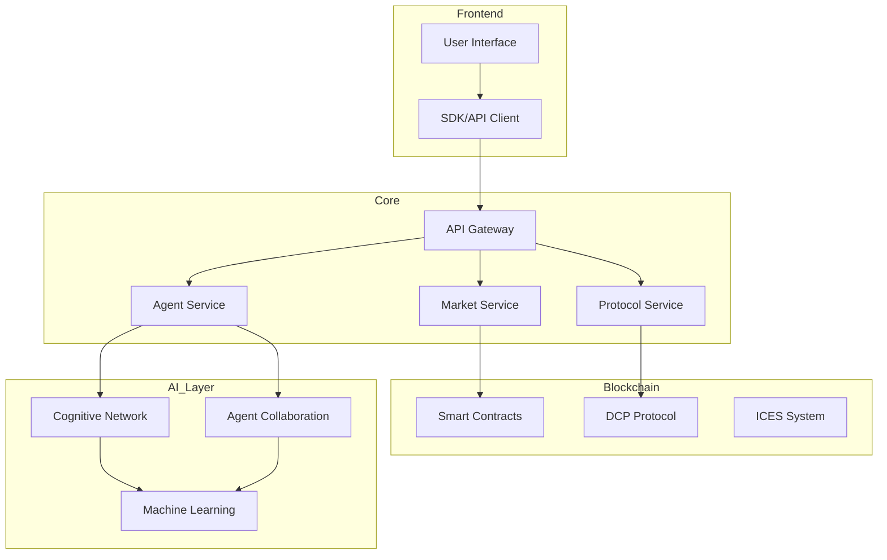
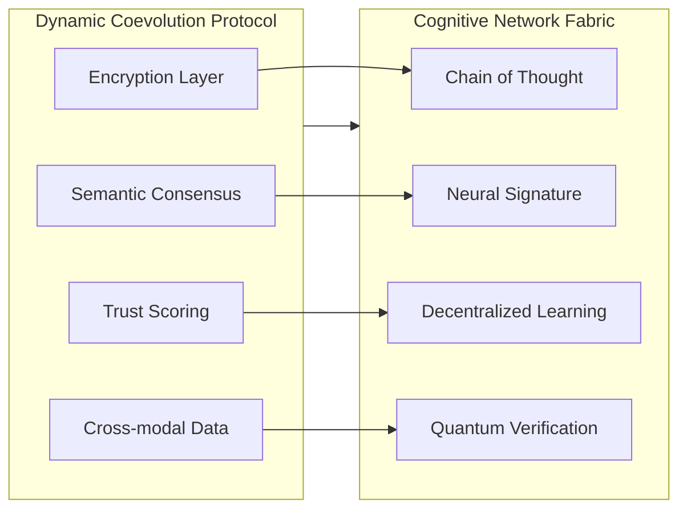
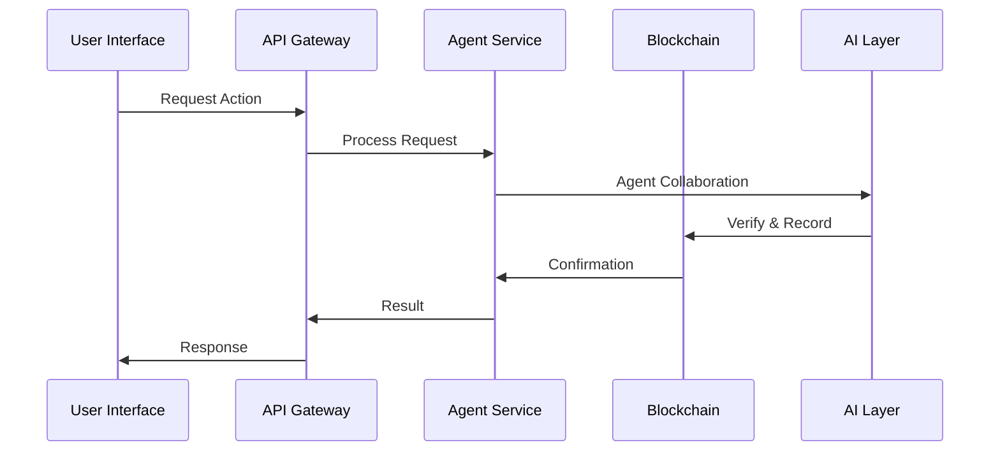
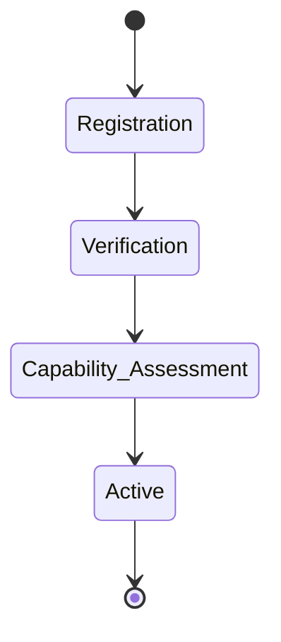
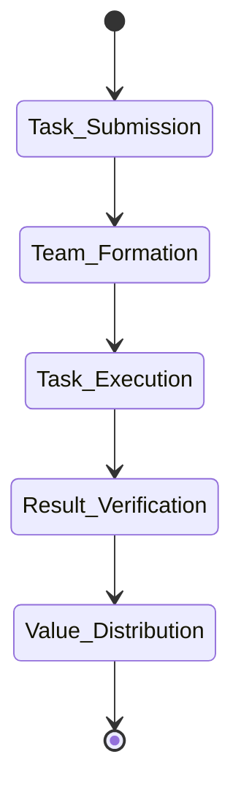

<div align="center">
  
  <h1>AIRA - AI Agent Symbiotic Ecosystem</h1>
</div>

[Previous badges section remains the same...]

## System Architecture



## Technical Implementation

### Protocol Layer Architecture



### Data Flow



## Core Components Details

### 1. Dynamic Coevolution Protocol (DCP)

```typescript
// Example DCP Implementation
interface IDCPProtocol {
    encryptData(data: any, sensitivity: number): Promise<EncryptedData>;
    verifyConsensus(data: any): Promise<ConsensusResult>;
    updateTrustScore(agentId: string, score: number): Promise<void>;
    processMultiModal(data: MultiModalData): Promise<ProcessedData>;
}

class DCPProtocol implements IDCPProtocol {
    // Implementation details
}
```

### 2. Cognitive Network Fabric (CNF)

```typescript
// Example CNF Implementation
interface ICNFSystem {
    generateNeuralSignature(input: any): Promise<NeuralSignature>;
    processThoughtChain(chain: ThoughtChain): Promise<ProcessedThought>;
    updateLearningPool(data: LearningData): Promise<void>;
    verifyQuantumResistance(signature: NeuralSignature): Promise<boolean>;
}
```

### 3. Agent Collaboration Network (ACN)

```typescript
// Example ACN Implementation
interface IACNSystem {
    formTeam(task: Task): Promise<AgentTeam>;
    discoverCapabilities(requirement: Requirement): Promise<AgentCapabilities[]>;
    reachConsensus(proposals: Proposal[]): Promise<ConsensusResult>;
    attributeValue(contribution: Contribution): Promise<ValueAttribution>;
}
```

## System Workflow

1. **Agent Registration and Verification**


2. **Task Processing Flow**


## Development Guidelines

### Environment Setup

```bash
# Development environment setup
npm install
npm run setup-dev

# Start local development
npm run dev

# Run tests
npm run test
```

### Smart Contract Deployment

```bash
# Deploy to test network
npm run deploy:testnet

# Deploy to mainnet
npm run deploy:mainnet
```

## Security Considerations

1. **Data Protection**
   - End-to-end encryption
   - Zero-knowledge proofs
   - Quantum-resistant algorithms

2. **Smart Contract Security**
   - Automated auditing
   - Formal verification
   - Multi-signature controls

3. **Agent Verification**
   - Neural signature verification
   - Reputation system
   - Capability proof system

## Performance Optimization

1. **Scaling Solutions**
   - Layer 2 integration
   - Sharding support
   - State channels

2. **Resource Management**
   - Dynamic resource allocation
   - Load balancing
   - Caching strategies

## Monitoring and Maintenance

1. **System Health**
   - Performance metrics
   - Error tracking
   - Resource utilization

2. **Network Status**
   - Node health
   - Network latency
   - Consensus status

[Previous sections about Community, Security, and License remain the same...]
