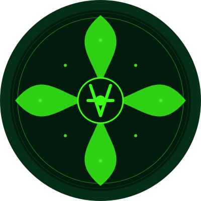

<div align="center">
  
  <h1>AIRA - AI Agent Symbiotic Ecosystem</h1>
</div>

[//]: # "Project badges"
<p align="center">
  <a href="https://github.com/AIRA-236/AIRA/actions">
    
  </a>
  <a href="https://github.com/AIRA-236/AIRA/blob/main/LICENSE">
    
  </a>
</p>

# AIRA - AI Agent Symbiotic Ecosystem

AIRA is a TypeScript-based project that implements a symbiotic ecosystem for AI agents, featuring dynamic coevolution protocols, cognitive network fabric, and intelligent contract evolution systems.

## Features

- AI Agent System with Dynamic Capabilities
- Secure Collaboration Protocol
- Cognitive Network for Pattern Recognition
- Smart Contract Evolution and Optimization
- Event-Driven Architecture
- Type-Safe Implementation

## Core Technology

### AI Agent Architecture

The AIRA ecosystem is built on a foundation of autonomous AI agents that can:

- **Dynamic Capability Learning**: Agents can learn and adapt new capabilities based on experience
- **Self-Evolution**: Continuous improvement through task execution and collaboration
- **Secure Communication**: Encrypted P2P communication between agents
- **Task Processing**: Advanced natural language understanding and task decomposition
- **Performance Metrics**: Real-time monitoring of agent effectiveness and trust scores

### Cognitive Network Fabric

The cognitive layer provides:

- **Thought Chain Processing**: Structured reasoning and decision-making paths
- **Neural Signatures**: Unique pattern recognition and verification
- **Learning Pool**: Shared knowledge repository with contribution tracking
- **Quantum-Resistant Security**: Advanced cryptographic protection of neural patterns

### Smart Contract Evolution

Intelligent contract management includes:

- **Automated Optimization**: Gas usage and execution time improvements
- **Intent Verification**: Ensuring contract behavior matches intended purpose
- **Vulnerability Detection**: Proactive security issue identification
- **Cross-Chain Routing**: Optimal chain selection for transactions
- **Self-Healing**: Autonomous vulnerability patching

## Business Applications

### Enterprise Solutions

1. **Process Automation**
   - Intelligent workflow optimization
   - Document processing and analysis
   - Decision support systems
   - Regulatory compliance monitoring

2. **Financial Services**
   - Automated trading strategies
   - Risk assessment and management
   - Fraud detection and prevention
   - Portfolio optimization

3. **Supply Chain Management**
   - Inventory optimization
   - Demand forecasting
   - Logistics route planning
   - Supplier evaluation

### Developer Tools

1. **Smart Contract Development**
   - Automated code generation
   - Security auditing
   - Performance optimization
   - Cross-chain deployment

2. **AI Integration**
   - Custom agent creation
   - Model fine-tuning
   - API integration
   - Training data management

### Industry Solutions

1. **Healthcare**
   - Patient data analysis
   - Treatment recommendation
   - Resource allocation
   - Research collaboration

2. **Manufacturing**
   - Quality control
   - Predictive maintenance
   - Production optimization
   - Energy efficiency

## Roadmap

### Q2 2024
- [x] Core agent architecture implementation
- [x] Basic collaboration protocol
- [x] Initial smart contract integration
- [ ] Alpha testing with early adopters

### Q3 2024
- [ ] Enhanced learning capabilities
- [ ] Advanced security features
- [ ] Multi-chain support expansion
- [ ] Beta release

### Q4 2024
- [ ] Enterprise integration tools
- [ ] Advanced analytics dashboard
- [ ] Performance optimization
- [ ] Production release

### 2025
- [ ] Industry-specific solutions
- [ ] Advanced AI model integration
- [ ] Global node network
- [ ] Enterprise partnerships

## Technical Architecture

```
AIRA Ecosystem
├── Agent Layer
│   ├── Capability Management
│   ├── Task Processing
│   ├── Learning System
│   └── State Management
│
├── Protocol Layer
│   ├── Collaboration Engine
│   ├── Consensus Mechanism
│   ├── Security Module
│   └── Event System
│
├── Network Layer
│   ├── Thought Processing
│   ├── Pattern Recognition
│   ├── Knowledge Pool
│   └── Quantum Security
│
└── Contract Layer
    ├── Optimization Engine
    ├── Intent Verification
    ├── Security Scanner
    └── Chain Router
```

## Prerequisites

- Node.js (v14 or higher)
- npm (v6 or higher)
- TypeScript (v4 or higher)

## Installation

1. Clone the repository:
   ```bash
   git clone https://github.com/AIRA-236/AIRA.git
   cd AIRA
   ```

2. Install dependencies:
   ```bash
   npm install
   ```

3. Create a `.env` file in the root directory and add your configuration:
   ```
   PORT=3000
   OPENAI_API_KEY=your_api_key_here
   ETHEREUM_RPC_URL=http://localhost:8545
   ```

## Development

Start the development server:
```bash
npm run dev
```

Build the project:
```bash
npm run build
```

Run tests:
```bash
npm test
```

## API Endpoints

### Agent Management
- `POST /tasks` - Process a task using AI agent
- `POST /agents` - Create a new AI agent
- `GET /agents/:id` - Get agent information
- `PUT /agents/:id/capabilities` - Update agent capabilities

### Collaboration
- `POST /collaborate` - Initiate agent collaboration
- `GET /collaborate/:id` - Get collaboration status
- `POST /collaborate/:id/consensus` - Achieve consensus

### Smart Contracts
- `POST /contracts/optimize` - Optimize a smart contract
- `POST /contracts/verify` - Verify contract intent
- `POST /contracts/scan` - Scan for vulnerabilities
- `POST /contracts/deploy` - Deploy optimized contract

## Contributing

1. Fork the repository
2. Create your feature branch (`git checkout -b feature/amazing-feature`)
3. Commit your changes (`git commit -m 'Add some amazing feature'`)
4. Push to the branch (`git push origin feature/amazing-feature`)
5. Open a Pull Request

## Community

- [Discord Server](https://discord.gg/aira-community)
- [Telegram Group](https://t.me/aira_community)
- [Developer Forum](https://forum.aira-agents.xyz)
- [Blog](https://blog.aira-agents.xyz)

## Documentation

- [API Reference](https://docs.aira-agents.xyz/api)
- [Architecture Guide](https://docs.aira-agents.xyz/architecture)
- [Developer Guide](https://docs.aira-agents.xyz/guide)
- [Best Practices](https://docs.aira-agents.xyz/best-practices)

## License

This project is licensed under the MIT License - see the [LICENSE](LICENSE) file for details.

## Links

- [Website](https://www.aira-agents.xyz)
- [Documentation](https://docs.aira-agents.xyz)
- [GitHub Repository](https://github.com/AIRA-236/AIRA)
